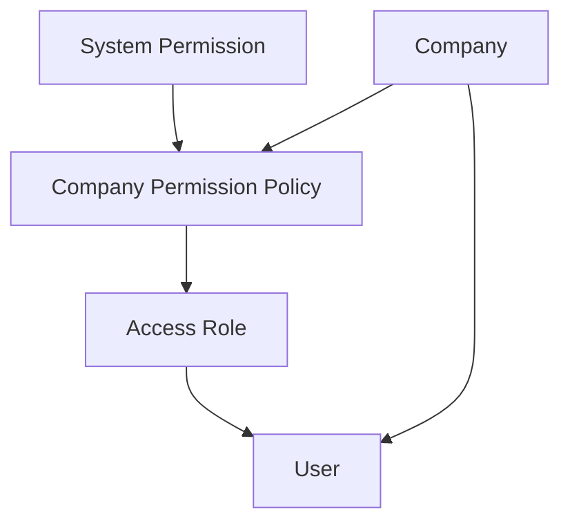
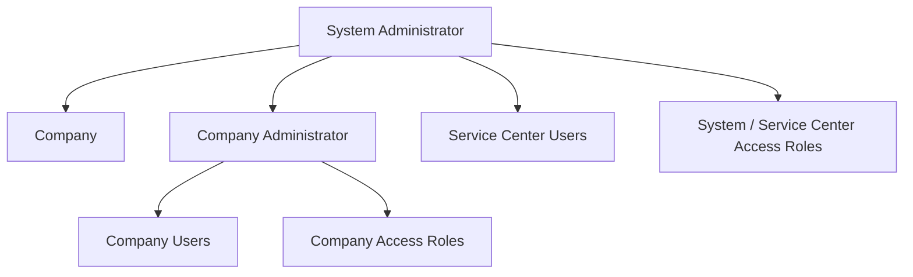
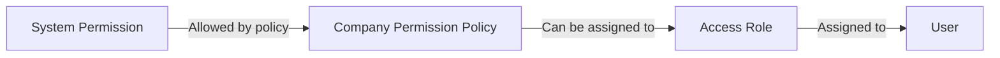
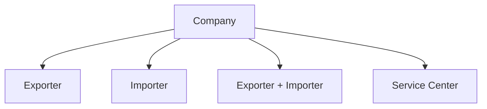

## Authorization and Access Control Architecture

### 1. Authorization Model

```mermaid
flowchart TD
    SP[System Permission]
    CPP[Company Permission Policy]
    AR[Access Role]
    U[User]
    C[Company]

    SP --> CPP
    CPP --> AR
    AR --> U
    C --> CPP
    C --> U
```

### 2. Administrative Hierarchy

```mermaid
flowchart TD
    SA[System Administrator]

    SA --> C[Company]
    SA --> CA[Company Administrator]
    SA --> SC[Service Center Users]
    CA --> CU[Company Users]
    CA --> AR[Company Access Roles]
    SA --> SAR[System / Service Center Access Roles]
```

### 3. Permission Delegation

```mermaid
flowchart LR
    SP[System Permission]
    CPP[Company Permission Policy]
    AR[Access Role]
    U[User]

    SP -->|Allowed by policy| CPP
    CPP -->|Can be assigned to| AR
    AR -->|Assigned to| U
```

### 4. Companies and Business Roles

```mermaid
flowchart TD
    C[Company]

    C --> E[Exporter]
    C --> I[Importer]
    C --> B[Exporter + Importer]
    C --> SC[Service Center]
```