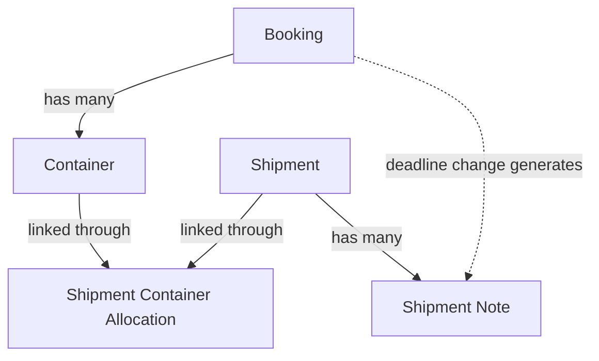
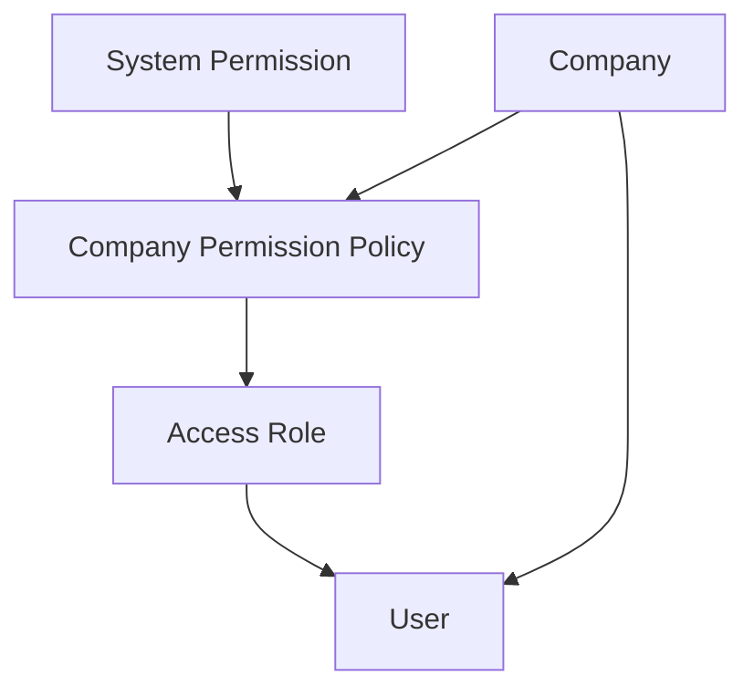
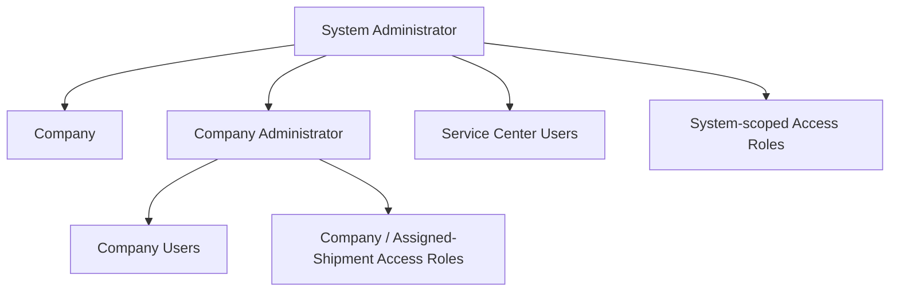
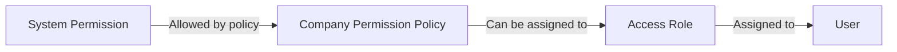
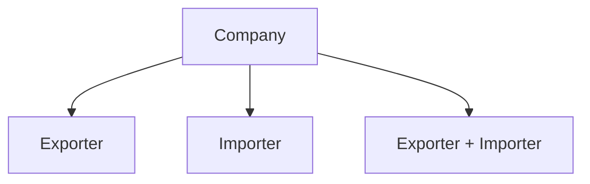

### Project Context

This project is designed to support the international trade operations of a corporate group. Its scope centers on a Service Center: a team that manages export and import processes on behalf of the group's companies, while also providing the information needed by external parties involved in those processes.

## The Service Center

The Service Center is not a company in its own right. It is a team legally hosted within one of the group's own companies (an exporter and/or importer like any other under Brazilian law, with its own CNPJ), but which does not itself export or import.

What distinguishes a Service Center user from an ordinary commercial or purchasing user of that same company is not the company they belong to, but the scope of their Access Role. Access Roles support three scope levels: SYSTEM, granting visibility over shipments across the entire group regardless of which group company is the exporter or importer of a given shipment (used by Service Center users); COMPANY, restricting visibility to the shipments of the user's own company (used by that company's sales or purchasing teams); and ASSIGNED_SHIPMENT, restricting visibility further to only the shipments where the user's company has an assigned responsibility, such as carrier or warehouse (intended for external logistics chain participants).

Because a SYSTEM-scoped Access Role grants access far beyond a single company, only the System Administrator can create or assign one. A Company Administrator, even of the company that legally hosts the Service Center, can only create and assign COMPANY or ASSIGNED_SHIPMENT Access Roles for their own company, and cannot change the Access Role of a user who currently holds a SYSTEM-scoped Access Role, in either direction. This prevents Service Center-level access from being granted, revoked, or altered by anyone other than the System Administrator.

## Users linked to multiple companies

A User is not limited to a single company. Since the same person may need to act on behalf of more than one group company — for example, handling exports for a Brazilian entity and imports for a US entity of the same group — a User holds a list of links, each pairing one company with one Access Role. A user with a single responsibility simply has one link; a Service Center user also has a single link, but one whose Access Role happens to be SYSTEM-scoped, which is why it already grants group-wide visibility without needing more than one link.

Each link's Access Role must belong to the same company as that link, unless the Access Role is SYSTEM-scoped (which belongs to no company). A User cannot have more than one link to the same company.

Links are always evaluated in isolation from one another: authorization is never "does this user have permission X anywhere", it is "does this user have a link to this specific company that grants permission X". A broader Access Role on one link never carries over to another link with a different, more limited company — the same principle already used to keep a carrier's export-stage and import-stage visibility separate on an INTERCOMPANY shipment, applied here one level up, between a user's links to different companies.

## Group companies and external companies

Every company registered in the system is either a group company or an external one, tracked through the isGroupCompany flag. A shipment's exporter and importer are always required to include at least one group company; a shipment where neither is a group company is invalid. External companies, such as a foreign buyer or a third-party carrier or warehouse, participate in a shipment without being managed as part of the group.

Because both the exporter and the importer of a shipment can be group companies, each shipment carries a processType classification, derived from the isGroupCompany flag of its exporter and importer: EXPORT (only the exporter is a group company), IMPORT (only the importer is a group company), or INTERCOMPANY (both are group companies, typically entities of the same group in different countries). This classification is a summary label for reports and dashboards; it does not replace the operational distinction between the export and import sides of an INTERCOMPANY process, which is instead handled by the shipment's exportStage and importStage.

## Beyond the group: other logistics chain participants

While the project's original scope is the group's own export and import processes managed through its Service Center, the underlying model, companies with business roles governed by Access Roles and Permission Policies, is not limited to exporters and importers. A Company's businessRoles already include CARRIER and WAREHOUSE alongside EXPORTER and IMPORTER, so other participants of the logistics chain can be registered today, each gaining visibility only into the shipments where they have been assigned that responsibility.

## Shipment Lifecycle: Bookings, Containers, and Notes

A shipment is itself the commercial invoice for its process. Its physical cargo is tracked through a separate logistics domain, built around three concepts: Booking, Container, and the allocation that links them to shipments.

## Booking and Container

A Booking is the reservation made with an ocean carrier, identified by a single booking number. It carries the vessel, voyage, ports, estimated dates, and deadlines, such as cargo cutoff and document cutoff. These deadlines apply uniformly to every Container linked to that Booking; they are not duplicated per container.

At the time a Booking is created, only the requested container quantity and type are known, for example, four 20ft containers, since the physical containers have not yet been picked up from the depot. Each Container is therefore registered progressively: it starts with only its size/type defined, and its containerNumber is filled in once the empty container is retrieved. This step is frequently carried out by the carrier or logistics operator responsible for the pickup, a concrete case of a User acting under an ASSIGNED_SHIPMENT Access Role. Unlike deadlines, which live on the Booking, each Container records its own realized operational dates (empty pickup, gate-in, return), since containers under the same Booking reach these milestones individually and at different times.

## Linking shipments to containers

A single Container can carry cargo from more than one Shipment, for example, two shipments each occupying half of the same container, and a single Shipment's cargo can be split across more than one Container. The Shipment Container Allocation resolves this many-to-many relationship, and is also the basis for an ASSIGNED_SHIPMENT Access Role's visibility into container data: a carrier or warehouse Company gains visibility into the Containers its assigned Shipments are allocated to, and no others.

When a shipment has separate exportStage and importStage subdocuments (an INTERCOMPANY process handled on both sides), ASSIGNED_SHIPMENT visibility is resolved per stage, not for the shipment as a whole: a Company assigned as carrier or warehouse on only the exportStage sees that stage alone, never the importStage. This keeps two unrelated external companies, such as the carrier handling the export leg and the carrier handling the import leg of the same shipment, from seeing each other's side of the process.

## Shipment activity feed

Each Shipment maintains an activity feed of Shipment Notes, combining two kinds of entries: SYSTEM notes, generated automatically, such as a status change or a Booking deadline update affecting the shipment through one of its allocated containers; and USER notes, written manually by someone involved in the process, which can be marked public or private so that internal remarks are not necessarily exposed to external ASSIGNED_SHIPMENT users. A note can reference the specific Container or Booking it relates to, which matters because a shipment may only share part of its containers with a given Booking.

## Authorization and Access Control Architecture

### 1. Authorization Model

### 2. Administrative Hierarchy

### 3. Permission Delegation

### 4. Companies and Business Roles

