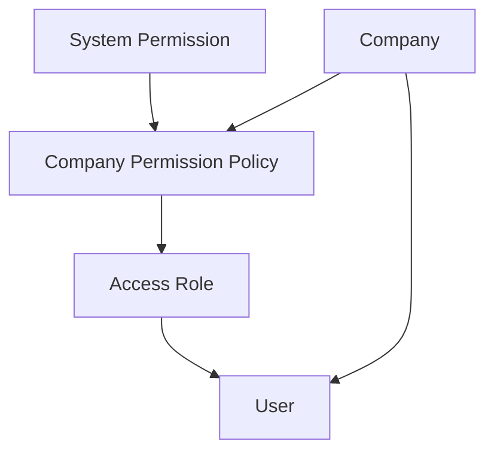
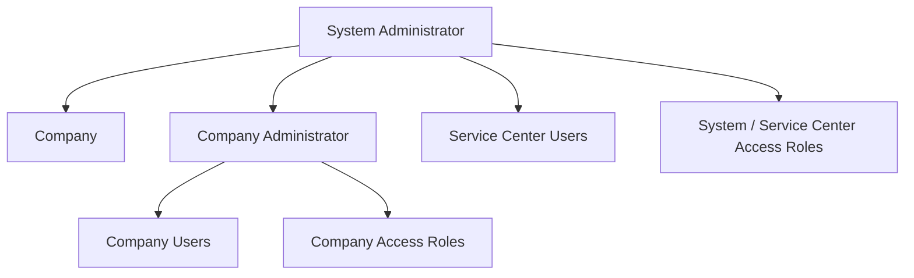
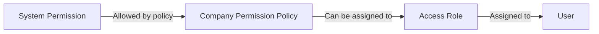
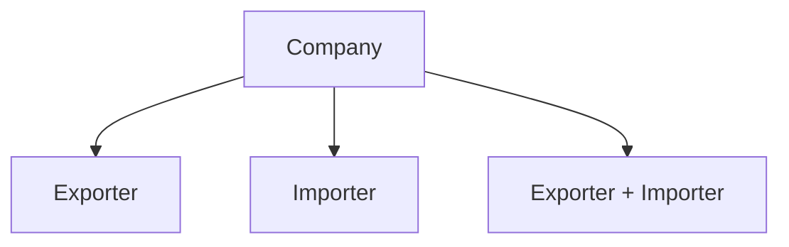

## Project Context

This project is designed to support the international trade operations of a corporate group. Its scope centers on a Service Center: a team that manages export and import processes on behalf of the group's companies, while also providing the information needed by external parties involved in those processes.

### The Service Center

The Service Center is not a company in its own right. It is a team legally hosted within one of the group's own companies (an exporter and/or importer like any other under Brazilian law, with its own CNPJ), but which does not itself export or import.

What distinguishes a Service Center user from an ordinary commercial or purchasing user of that same company is not the company they belong to, but the scope of their Access Role: Service Center users hold a system-level Access Role, granting them visibility over shipments across the entire group, regardless of which group company is the exporter or importer of a given shipment. Ordinary users of that same company, such as its sales or purchasing teams, hold company-level Access Roles instead, restricting their visibility to their own company's shipments.

Because a system-level Access Role grants access far beyond a single company, only the System Administrator can create or assign one. A Company Administrator, even of the company that legally hosts the Service Center, can only create and assign company-level Access Roles for their own company, and cannot change the Access Role of a user who currently holds a system-level Access Role, in either direction. This prevents Service Center-level access from being granted, revoked, or altered by anyone other than the System Administrator.

### Group companies and external companies
Every company registered in the system is either a group company or an external one, tracked through the isIntercompany flag. A shipment's exporter and importer are always required to include at least one group company; external companies, such as a foreign buyer or a third-party carrier or warehouse, participate in a shipment without being managed as part of the group.

Because both the exporter and the importer of a shipment can be group companies, each shipment carries a process classification, derived from the isIntercompany flag of its exporter and importer: an export, an import, or an intercompany/global process. This avoids ambiguity in reports when a shipment cannot be described as purely an export or an import.

### Beyond the group: other logistics chain participants
While the project's original scope is the group's own export and import processes managed through its Service Center, the underlying model, companies with business roles governed by Access Roles and Permission Policies, is intentionally not limited to exporters and importers. It is designed to extend to other participants of the logistics chain, such as carriers and warehousing companies, each gaining visibility only into the shipments where they have been assigned that responsibility.

## Authorization and Access Control Architecture

### 1. Authorization Model

### 2. Administrative Hierarchy

### 3. Permission Delegation

### 4. Companies and Business Roles

